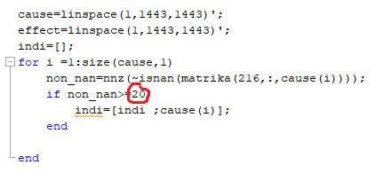

# Kavzalnost
Ta projekt je namenjen iskanju kavzalnosti v različnih dataset-ih s poudarkom na indikatorjih, ki so povezani s Sustainable Development Goals.

# Program
Dataset, ki sem ga uporabljal je dostopen na https://datacatalog.worldbank.org/dataset/world-development-indicators pod zavihkom Data & Resources

## Datoteke
### Koda
### Podatki
Shranjeni podatki, ki se uporabljajo v kodi. Priporočam, da jih uporabljate, saj je čas izračunanja zelo dolg (~10h)
### Rezultati
Tu se nahajajo rezultati, ki sem jih dobil pri moji obdevali.

# Navodila
1. Nalozi dataset https://datacatalog.worldbank.org/dataset/world-development-indicators

2. Odpri Projekt.m in importaj dataset

3. datSetToMatrix sprejme naš data set in ga spremeni v 3D matriko (matrika), kjer je prva komponenta enaka državam,druga komponenta je enaka času in treja komponenta enaka indikatorju. Poleg matrike še vrne seznam drzave in indikatorji, kjer imamo shranjene id-je.

4. izberimo si zažljene lag-e, test, stopnjo zaupanja (alpha) in idDrzave (216=Slovenia), ki nas zanima.

5. Ker je veliko vrednosti v dataset-u enako NaN si izberemo neko konstanto( npr 20) in gledamo samo tiste indekse, ki imajo vsaj toliko ne NaN vrednosti 

6.  **Funkcija vplivi traja zelo dolgo (~10h) priporočam da uporabite moj izračun Podatki20.mat**

7. Rezultate trenutno lahko dobimo v 2 oblikah:
    1. Kot grafi - kličemo funkciji matrix2graph in matrix2svg
    2. kot .txt datoteko - kličemo matrix2txt. 

V mapi Rezultati se nahajo rezultati za moj primer.
 

